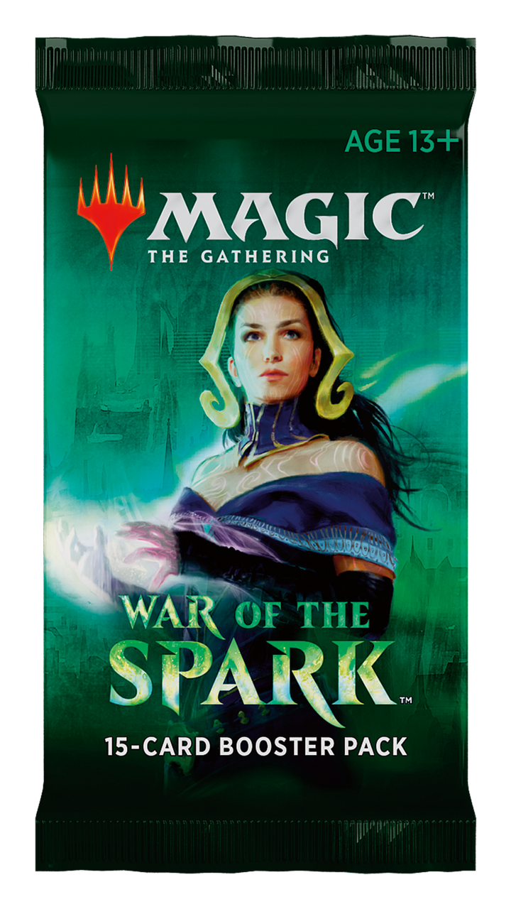

# TP API

## Installation

```
npm install
npm run dev
```

## But de l'application en une phrase

Simulateur de draft Magic the Gathering.

## URL de l'API utilisée

"https://api.scryfall.com/cards/search?order=rarity&q=set%3Awar" et la page d'après.

## Liste des routes sollicitées

J'ai plus de voiture....

## Fonctionnement détaillé de l'application


Le principe est de reproduire un draft sur Magic le fonctionnement est assez compliqué :
Voir les principes de draft sur https://magic.wizards.com/fr/articles/archive/how-play-limited/le-booster-draft-de-quoi-il-sagit-et-comment-y-jouer-2017-11-07’. C'est assez long a expliquer mais en
substance :

Chaque joueur commence avec trois boosters, il pick une carte et le fait passer a son voisin de
gauche qui as lui même pris une carte, il reprends une carte et ainsi de suite jusqu'à épuisement du booster.
Ensuite le joueur ouvre un autre booster mais le passe a son voisin de droite qui a son tour le passe a son voisin de droite
après son pick etc..
Et pour le dernier booster pareil mais dans l'autre sens ( vers la gauche ).
Le but est de se constituer un deck le plus optimisé possible, selon différents archétypes ( variables selon les extensions par exemple dans war of the spark sur lequel j'ai décidé de faire le TP : Azorius Fly .),
et bien sûr les joueurs devront jouer les uns contre les autres ce que je n'ai pas implémenté que je n'en ai pas l'intention
sinon je vais avoir des problèmes avec Wizard of the Coast ( l'éditeur de Magic ). Si c'est du chinois je pense que le lien le résumera mieux que moi.

