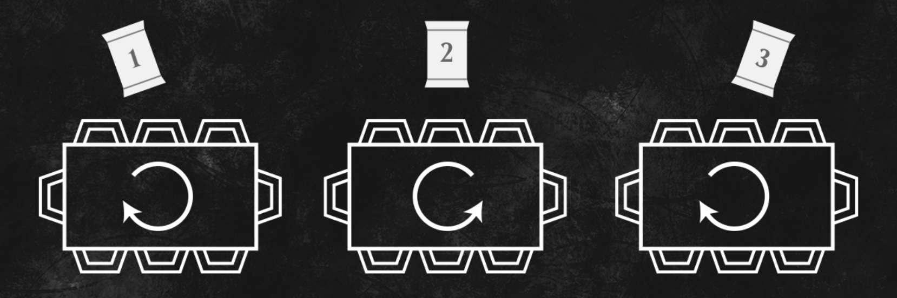

# TP API

## Installation

```
npm install
npm run dev
```

## But de l'application en une phrase

Simulateur de draft Magic the Gathering .

## URL de l'API utilisée

https://scryfall.com/docs/api

## Liste des routes sollicitées

"https://api.scryfall.com/cards/search?order=rarity&q=set%3Awar".

et 6 autres extensions l'url est dynamique selon l'extension grace au select.

Et "https://murmuring-springs-05651.herokuapp.com/cards" pour les notations des cartes (api au passage incomplète mais impossible d'en trouver une correcte).

## Fonctionnement détaillé de l'application

<p align="center">
  
</p>

Pas de différences entre chrome et firefox sauf que firefox ne reconnait pas la police.

Le principe est de reproduire un draft sur Magic et le fonctionnement est assez complexe.
C'est assez long a expliquer mais en substance :

Chaque joueur commence avec trois boosters, il pick une carte et le fait passer a son voisin de
gauche qui as lui même pris une carte dans son booster, il reprends une carte dans celui qu'il vient d'avoir
et ainsi de suite jusqu'à épuisement du booster.
Ensuite le joueur ouvre un autre booster mais le passe a son voisin de droite qui a son tour le passe a son voisin de droite
après son pick etc..
Et pour le dernier booster pareil mais dans l'autre sens ( vers la gauche ).

<p align="center">
  
</p>

Le but est de se constituer un deck le plus optimisé possible, selon différents archétypes ( variables selon les extensions par exemple dans war of the spark : Azorius Fly ),
et bien sûr les joueurs devront jouer les uns contre les autres ce que je n'ai pas implémenté et que je n'en ai pas l'intention
sinon je vais avoir des problèmes avec Wizard of the Coast ( l'éditeur de Magic ). Si c'est du chinois je pense que le lien le résumera mieux que moi.

Voir les principes de draft [ici](https://magic.wizards.com/fr/articles/archive/how-play-limited/le-booster-draft-de-quoi-il-sagit-et-comment-y-jouer-2017-11-07).

<p align="center">
  
</p>

## Prochaines features :

- Finir le boutton notes pour les cartes.

- Fixer le problème de fonts sur Firefox.

- Partager son Deck une fois la phase de picks finie.

- Support mobile complet

- Soon...
